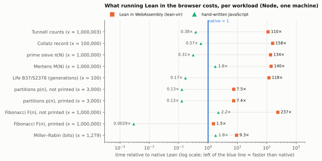
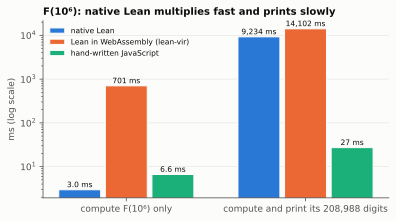

# Lean math in the browser

**An educational test bed.** Classical number-theory computations written in Lean 4, run in
the browser through [lean-vir](https://github.com/ejgallego/lean-vir) (Lean's IR interpreter
compiled to WebAssembly), checked against independent references, and timed against native
Lean and hand-written JavaScript.

> **Status: experimental, for learning and testing.** This is not a library, not a product
> and not affiliated with the Lean FRO or with lean-vir. lean-vir is pinned to one commit and
> its authors say its browser-binding surface will change; the numbers here describe that
> commit on the machines listed, nothing more.

→ **[The report](docs/REPORT.md)**: method, results, charts, what we found and the limits of it.

## Results at a glance

**What running Lean in the browser costs.** Loops and arrays run about 110–160× slower through
lean-vir than compiled natively; where big-integer arithmetic dominates the gap falls to about 7–9×.
Small inputs still answer in milliseconds.



**Keep the page responsive: use a Web Worker.** The whole benchmark (about 46 s of computation) run
in a Worker never cost the page a frame; the same code on the main thread froze it for 46 s.


**Big numbers: printing, not multiplying.** Natively, F(10⁶) takes 3 ms to compute and 9.2 s to print
in decimal; in the browser, multiplication itself is ~240× slower because lean-vir's runtime uses
Lean's portable big-number fallback instead of GMP.



**One call is cheap.** A call from JavaScript with a small argument costs about 2 µs; passing a string
in costs about 2 ns per character (twice that with accents or emoji, which also make the way back
cost more). Measured in Node only so far; Chrome, Firefox and Safari are still to
do ([report, § 4.6](docs/REPORT.md#46-what-one-call-costs)).

**And the mathematics.** Every squarefree n ≡ 5, 6, 7 (mod 8) up to 10,000 satisfies Tunnell's
criterion (congruent if BSD holds); in the other classes only 11–17 % do.


## Where this comes from

In September 2026 someone asked on the Lean Zulip, in
[*DOM Manipulation in Lean*](https://leanprover.zulipchat.com/#narrow/channel/113488-general/topic/DOM.20Manipulation.20in.20Lean)
(#general), what the options were for manipulating a web page from Lean. The replies pointed
to ProofWidgets4 for an HTML model and to lean-vir, which compiles a subset of Lean to
WebAssembly; one of lean-vir's authors added that its DOM bindings are still expected to
change, but that *pure* Lean programs running in WebAssembly are a much more stable surface.

That last remark is what this repository tests, out of curiosity: take small pure Lean
programs of the kind a mathematician would write, run them in a browser, and check — as
carefully as we can — that they give the right answers, what it costs, and what breaks. It
started with one function (Tunnell's criterion for congruent numbers) and grew into a small
benchmark of eight workloads.

## What is here

| path | what it is |
|---|---|
| [`Tunnell.lean`](Tunnell.lean) | Tunnell's criterion: lattice-point counts, with an honest verdict (`2A ≠ B` ⇒ not congruent, unconditionally; `2A = B` ⇒ congruent *if* BSD holds) |
| [`Bench.lean`](Bench.lean) | the other workloads: Collatz record, sieve π(N), Mertens M(N), partitions p(n), Fibonacci, Miller–Rabin, Life B37/S2378 |
| [`Main.lean`](Main.lean) | the same code as a native command-line program, for comparison and timing |
| [`site/`](site/) | a static page that decides Tunnell's criterion in the browser, in a Web Worker |
| [`bench/`](bench/) | references (Python, different algorithms), the JavaScript baseline, the timing harnesses, the charts |
| [`tests/`](tests/) | the differential test suite |
| [`docs/`](docs/) | the report and its figures |

Every loop in the Lean files is structural (or tail) recursion on an explicit bound, so the
Lean kernel can evaluate the small cases (`decide +kernel`) — the report explains why
ordinary `for`/`while` loops could not be used — and core Lean only, no Mathlib.

## Checks at a glance

* The kernel evaluates each function on small cases with known values (OEIS).
* The WebAssembly build equals native Lean and an independent Python count on every n ≤ 10,000
  for Tunnell, and on every benchmark case; the squarefree n that pass Tunnell's criterion are
  exactly OEIS A003273 up to 9,999.
* The page works under a strict Content-Security-Policy (only `'wasm-unsafe-eval'` added).

## Run it

Lean 4 `v4.34.0` (see `lean-toolchain`); lean-vir is pinned in `lakefile.lean`.

```sh
lake build                          # compiles, and the kernel runs the checks
lake build +Tunnell:vir +Bench:vir  # the WebAssembly packages (.lake/build/vir/module-sets/)
lake build :virSdk                  # the browser runtime (needs GITHUB_TOKEN while lean-vir has no release)
python bench/servir.py              # then open http://127.0.0.1:8125/site/
```

The test suite (what CI runs) needs the native references first:

```sh
lake build tunnell_cli && mkdir -p tests/out
.lake/build/bin/tunnell_cli 1 10000 > tests/out/nativo.txt
.lake/build/bin/tunnell_cli --ns $(cat tests/azar.txt) > tests/out/nativo-azar.txt
python tests/referencia_rapida.py 1 10000 > tests/out/python.txt
python tests/referencia_rapida.py --ns $(cat tests/azar.txt) > tests/out/python-azar.txt
node tests/pruebas.mjs
```

The report's appendix lists the exact commands that produced every number.

## Licences

This repository: Apache License 2.0 ([`LICENSE`](LICENSE)). `site/lean-vir/` is the lean-vir
browser SDK, © Lean FRO LLC, Apache License 2.0 ([`site/lean-vir/LICENSE`](site/lean-vir/LICENSE)).
`b003273.txt` is from the OEIS (CC BY-SA 4.0).

Prepared with the help of an AI assistant (Claude, Anthropic); the author reviewed it and is
responsible for it.
