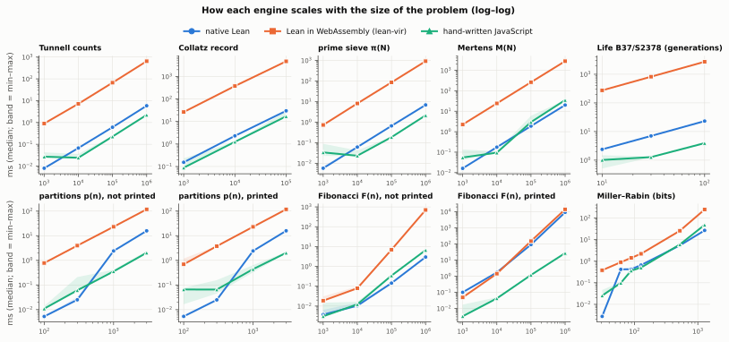
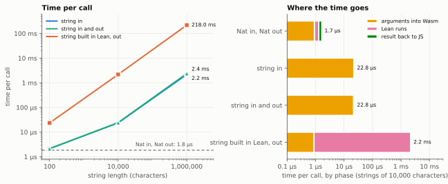
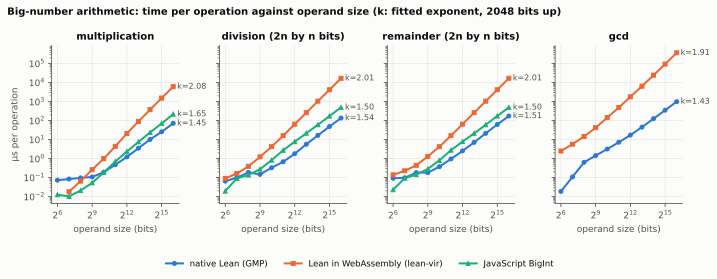
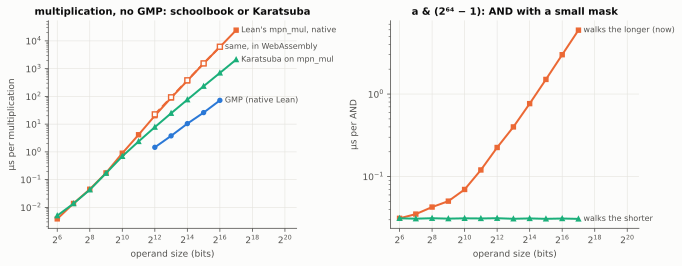
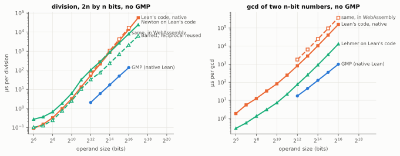
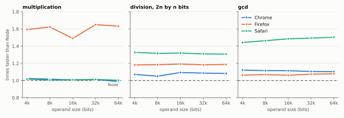

# Lean math in the browser: a small benchmark

*An educational experiment, September 2026. It started from a question on the Lean Zulip (see
the [README](../README.md#where-this-comes-from)) and asks something narrow: if a mathematician
writes small pure Lean programs, can they run in a web page through lean-vir, are the answers
right, and what does it cost?*

## 1. Setup

| | engine comparison | browser |
|---|---|---|
| machine | machine A | machine B |
| engines | native Lean (compiled), Lean in WebAssembly via lean-vir in Node 25, hand-written JavaScript in Node | Lean via lean-vir and the JavaScript baseline, both in headless Chrome (September 2026), in a Web Worker and on the main thread |
| Lean | v4.34.0, core only (no Mathlib) | same packages |
| lean-vir | commit `cdba5cac11eb` (no release yet), SDK artifact of that commit | same |

**Engines are only compared on the same machine.** Native Lean was built on machine A, so native vs
WebAssembly vs JavaScript is measured there; the browser section compares WebAssembly
with JavaScript inside the same Chrome. Ratios are never taken across machines.

**Method.** Every (engine, workload, size) gets one warm-up call, then 7 timed calls (5 above 1 s,
3 above 10 s); medians are reported, and the charts shade the min–max range. Native Lean is timed
inside its own process (`IO.monoNanosNow`), so process start-up is not counted. **Every timed call is
checked before its time is kept**: the warm-up value against a SHA-256 of the value computed by an
independent Python reference, and every timed repetition against that checked value, outside the clock
(the native CLI compares each repetition with the first and reports the mismatches). A fast wrong answer
cannot enter the results. Until 28 September 2026 only the warm-up value was checked, although this
paragraph already said every value was; see [Corrections](#corrections-28-september-2026).

## 2. Workloads

| workload | what it stresses | external reference |
|---|---|---|
| Tunnell's criterion | nested loops on small `Nat` | OEIS A003273, brute force |
| Collatz record ≤ N | recursion of unknown length | OEIS A006877 |
| sieve π(N) | writes into `Array Bool` | OEIS A000720 |
| Mertens M(N) | writes into `Array Int` | OEIS A002321 |
| partitions p(n) | big-`Nat` additions, dynamic programming | OEIS A000041 |
| Fibonacci F(n) | big-`Nat` multiplication (fast doubling) | Python, two algorithms |
| Miller–Rabin | modular powers of big `Nat` | known Mersenne primes |
| Life B37/S2378, 64×64 torus | array updates, many generations | Python/numpy |

The Python references use a **different algorithm** from the Lean code wherever there is one
(coin-change DP vs Euler's pentagonal recurrence, a linear Möbius sieve vs a sieve by primes,
iterative addition and matrix powers vs fast doubling, other Miller–Rabin bases), so agreement is
evidence rather than an echo. The JavaScript baseline uses the **same algorithms** as the Lean code,
so the ratio measures the runtime, not a better algorithm.

## 3. Correctness

* **Kernel.** Each file ends with `decide +kernel` checks on small cases with known values: Tunnell
  on n = 1, 2, 3 (fail) and 5, 6, 7 (pass); Collatz 27 → 111 steps; π(100) = 25; M(10) = −1;
  p(10) = 42; F(30) = 832040; 97 prime, 91 not. The kernel evaluates the same code the browser runs.
* **Differential.** For Tunnell, the WebAssembly build equals native Lean and an independent Python
  count on **every n from 1 to 10,000** and on 40 random n up to 2·10⁶; the squarefree n that pass
  are exactly the terms of OEIS A003273 up to 9,999 (6,083 numbers); the parity theorem of the Lax
  archive entry lax-712553 (the counts are even) holds on every n it applies to.
* **Benchmark cases.** All 40 cases × 3 engines on machine A (120 timed rows) returned the expected
  value on the warm-up call and on every timed repetition (rerun on 28 September 2026 with the
  corrected harness); none was discarded. The 34 cases × 2 engines × 3 profiles in Chrome returned the
  expected value on the warm-up call; that campaign predates the correction, so its timed repetitions
  were not compared (see [Corrections](#corrections-28-september-2026)).

## 4. Results

The full numbers are in [`tabla.md`](tabla.md); the charts are drawn from `bench/out/*.json` by
`bench/graficas.py`.

### 4.1 What the interpreter costs


On loops and arrays, Lean in WebAssembly is **about 110–160× slower than native Lean** (Tunnell 110×,
sieve 134×, Mertens 140×, Collatz 158×, Life 118× at the largest sizes). Across every case with a
measurable native time the median is 108×. That is the expected order for an IR interpreter compiled
to WebAssembly, not a defect: lean-vir runs Lean's own interpreter, it does not compile Lean to
WebAssembly.

Where big integers dominate, the gap is much smaller — partitions 7×, Miller–Rabin 9× — because the
time is spent inside the runtime's arithmetic, which is compiled code in both cases.

Against **hand-written JavaScript** doing the same thing, the WebAssembly build is roughly 60–700×
slower on most workloads (Tunnell 290×, sieve 428×, Life 696×, partitions 58×) and only 5× on
Miller–Rabin, where both spend their time in big-integer arithmetic. JavaScript is also
faster than *native* Lean on most array workloads (a typed array against a boxed `Array Bool`).

In absolute terms: Tunnell for n ≈ 10⁵ answers in 67 ms, π(10⁶) in 0.9 s, p(3000) in 0.12 s. For
interactive pages that is usable up to moderate sizes, and hopeless for heavy computation.

### 4.2 Scaling



The three engines scale in parallel on almost every workload — the interpreter adds a constant
factor, not a worse complexity. The two visible exceptions are native Lean jumping between 31 and
61 bits in Miller–Rabin and between p(300) and p(1000): that is where Lean's `Nat` stops being an
unboxed machine integer (below 2⁶³) and becomes a heap bignum.

### 4.3 Printing, not multiplying


Native Lean computes F(10⁶) (694,241 bits) in **3 ms** and needs **9.2 s to print its 208,988 decimal
digits**: `toString` on a `Nat` grows quadratically with the length (ten times the digits,
F(10⁵) → F(10⁶), took about a hundred times longer: 92 ms → 9.2 s). Timing the printed value would
have blamed the multiplication for the conversion, so every big-number workload is also measured
without printing (`⌊log₂⌋` of the result).

With printing taken out, **big-`Nat` multiplication in WebAssembly is ~240× slower than native**
(701 ms vs 3 ms), much more than big-`Nat` addition (partitions, 7×). The binaries explain it: the
native executable links GMP statically (209 GMP symbols), while the unstripped build of lean-vir's
runtime (`vir-upstream.dev.wasm`) contains no GMP and instead Lean's own fallback for big numbers
(`lean::mpn_mul`, `lean::mpz`, on 32-bit limbs). So big-number work in the browser runs on Lean's
portable fallback, not on GMP; whether GMP could be built for WebAssembly there is a question for
lean-vir's authors.

### 4.4 In the browser


Starting the Lean runtime in Chrome takes **55 ms at full CPU speed** from creating the worker to the first
answer (29 ms importing the JavaScript runtime, 11 ms downloading, 15 ms compiling the WebAssembly
and loading the packages, 1 ms for the first call), and 169 ms with the CPU slowed 4×. The download
is from a local server, so on a real network add the transfer of 768 KB (runtime) + ~50 KB (packages).
The real page answers its first question **187 ms after navigation** (450 ms on the slowed CPU).


The whole benchmark (about 46 s of computation) run **in a Web Worker never cost the page a frame**:
the longest gap between two frames was 18 ms, one frame at 60 Hz. The same code **on the main thread
froze the page for 46 s** (162 s with the CPU slowed 4×). Moving the work into a Worker cost nothing
measurable (main thread ÷ worker = 0.99, median over 23 cases).

Inside Chrome the WebAssembly build is ~170× slower than the same JavaScript (median over the cases
where both take > 0.5 ms), the same order as in Node (116× on machine A; different machines, so only
the order of magnitude is comparable).

### 4.5 The mathematics


Every squarefree n ≡ 5, 6, 7 (mod 8) up to 10,000 satisfies Tunnell's criterion (both counts are
zero for those classes), as expected; for n ≡ 1, 2, 3 (mod 8) only 11–17 % do. Under BSD every
squarefree n ≡ 5, 6, 7 (mod 8) is a congruent number; the unconditional statement is only that the
numbers that fail the criterion are not.

### 4.6 What one call costs

*Added on 30 September 2026, after a conversation with lean-vir's author about using Lean for
interactive pages.* A page like that calls Lean on every click or keystroke, so the cost of the call
matters more than the speed of a long computation. `Bench.lean` has four functions that do almost
nothing (`ident`, `strLength`, `fill`, `echo`), and `bench/medir-llamada.mjs` times them from Node.



| call | time per call | of which: arguments into Wasm | Lean runs | result back to JS |
|---|--:|--:|--:|--:|
| `ident`: a `Nat` in, a `Nat` out | 1.8 µs | 0.9 µs | 0.4 µs | 0.4 µs |
| `strLength`, 10,000 characters in | 24 µs | 22 µs | 0.3 µs | 0.25 µs |
| `echo`, 10,000 characters in and out | 24 µs | 22 µs | 0.3 µs | 0.8 µs |
| `fill`, 10,000 characters out | 2.1 ms | 1.2 µs | 2.1 ms | 1.1 µs |

The first column is the median over batches of calls; the split comes from the runtime's own
`callTimed`, median of 200 calls. What it shows:

* A small call costs about 2 µs. The first call after the runtime starts took 2 to 4 ms in two runs.
* Strings cost more than numbers, in both directions, and what the text contains matters:

  | a million characters | ASCII (`a`) | mixed (`aé😀`) |
  |---|--:|--:|
  | into Lean (`strLength`) | 2.2 ms | 4.4 ms |
  | back to JavaScript (the decode phase of `echo`) | 0.10 ms | 1.35 ms |

* **Into Lean**, most of the time is spent inside Wasm building the Lean string, not in JavaScript:
  `TextEncoder` alone takes about 0.3 ms of the 2.1 ms for ASCII. Encoding straight into Wasm memory
  with `TextEncoder.encodeInto` instead of `encode` plus a copy saves only 3–8 %
  (`bench/experimentos/strings-encodeinto.mjs`).
* **Back to JavaScript**, ASCII is cheap because `TextDecoder` has a fast path for it. Text with
  accents or emoji costs 13 times as much (about 1.3 ns per character): that is the UTF-8 to UTF-16
  conversion. It is still about three times cheaper than the way in.
* `fill` is slow for a different reason: `String.pushn` runs in the interpreter one character at a
  time, about 220 ns each. The time is in Lean, not at the boundary.

So calls with small arguments are cheap enough to make on every keystroke, and strings of hundreds of
kilobytes per call start to show.

**In browsers** (added 2 October 2026). The same bench, run in the current Chrome, Firefox and Safari on
machine A, inside a module Worker as a real page would (`bench/navegador/llamada.html`, served
cross-origin isolated by `bench/servir.py --aislado`), every value checked:

| | Node | Chrome | Firefox | Safari |
|---|--:|--:|--:|--:|
| one small call (`ident`) | 1.8 µs | 2.8 µs | 3.2 µs | 1.9 µs |
| a million ASCII characters into Lean | 2.2 ms | 3.7 ms | 2.8 ms | 4.6 ms |
| … and back to JavaScript | 0.10 ms | 0.21 ms | 0.18 ms | 0.12 ms |
| a million mixed characters into Lean | 4.4 ms | 6.2 ms | 6.8 ms | 4.7 ms |
| … and back to JavaScript | 1.35 ms | 2.9 ms | 1.7 ms | 3.4 ms |

The browsers keep the pattern Node shows: small calls cost a few microseconds, strings cost by their
length, and mixed text is the expensive case on the way back, where Chrome and Safari take 14 to 28
times longer than for ASCII. On the main thread, Chrome and Firefox stay within about 12 % of their
Worker numbers; Safari's main thread was clearly faster than its Worker on string calls (2.2 against
4.6 ms for a million ASCII characters into Lean), which we have not investigated
(`bench/out/llamada-*-principal.json`). The browsers' clocks, even
cross-origin isolated, tick every 5 µs (Chrome) or 20 µs (Firefox, Safari), so the per-phase split of
small calls is quantised to that step; the per-call times come from batches and are not affected.

### 4.7 Big-number arithmetic, one operation at a time

*Added on 3 October 2026.* § 4.3 found big-`Nat` multiplication ~240× slower in WebAssembly than
natively, at one size. To tell a slow constant from an algorithm that scales worse, `Arith.lean` times
each operation alone, at operand sizes from 64 to 65,536 bits, in the three engines.

**Method.** `Arith.run op bits reps` builds four pairs of `bits`-bit numbers from a 64-bit linear
congruential generator, applies one operation `reps` times and returns the sum of the low 64 bits of
the results: a small number, so nothing big is printed or passed to JavaScript. Division and
remainder divide a `2·bits`-bit number by a `bits`-bit one, as in a modular reduction. The time of one
operation is (median of 5 runs with R operations − median of 5 runs with none) ÷ R, with R chosen for
about 150 ms per run; the cost of a loop that does no arithmetic is then subtracted. Every engine and
size is checked against an independent Python computation (198 of 198 points), and the kernel checks
seven small cases (`decide +kernel`). If time ∝ bits^k, k is the slope in logarithms, fitted from
2,048 bits up, with a bootstrap 95 % interval that resamples the runs at every point
(`bench/experimentos/aritmetica.mjs`, `analizar_aritmetica.py`; data in
`bench/out/aritmetica-2026-10-03.json`).



| operation | native Lean (GMP) | Lean in WebAssembly (lean-vir) | JavaScript BigInt | WebAssembly ÷ native, 1,024 → 65,536 bits |
|---|--:|--:|--:|--:|
| multiplication | 1.45 (1.45–1.46) | **2.08** (2.08–2.09) | 1.65 (1.65–1.65) | 5× → 85× |
| division, 2n by n bits | 1.54 (1.54–1.55) | **2.01** (2.01–2.01) | 1.50 (1.49–1.50) | 13× → 124× |
| remainder, 2n by n bits | 1.51 (1.51–1.52) | **2.01** (2.00–2.01) | 1.50 (1.49–1.50) | 11× → 97× |
| gcd | 1.43 (1.42–1.43) | **1.91** (1.91–1.92) | — | 45× → 374× |

*Exponent k, with its 95 % interval. The gcd's local slope in WebAssembly is still rising at the
largest sizes (1.95, 1.98). JavaScript has no built-in gcd; ours is a Euclid loop, so it is left out.*

**In WebAssembly, all four operations are quadratic; natively, all four are clearly below that.** So
the gap is not a constant: it grows with the size of the numbers, as bits^0.5 to bits^0.6 (the
difference of the exponents). At a few hundred bits, the size of cryptographic arithmetic,
multiplication in WebAssembly is within 2× of native and division within 2–8×, but gcd is already
23–29× behind; at tens of thousands of bits every operation is one to two orders of magnitude behind.

The reason is in Lean's source. When Lean is built without GMP, as lean-vir's runtime is, `Nat` uses
its own big-number code (`src/runtime/mpn.cpp` and `mpz.cpp`; read at `v4.34.0`): multiplication is
Knuth's Algorithm M, the schoolbook method, with a comment in the code suggesting a faster one;
division is Knuth's Algorithm D; gcd is Euclid's algorithm with a full remainder at every step. All
three are quadratic, which is what the exponents measure. GMP switches to subquadratic algorithms as
numbers grow, and the native exponents (1.43–1.54) are in that range.

**A smaller finding: `&&&` with a small mask costs time proportional to the larger number.** The loop
that does no arithmetic still takes `a &&& (2⁶⁴ − 1)` for the checksum. Natively that costs nothing
measurable; in WebAssembly it grows from 1.2 µs at 64 bits to 4.7 µs at 65,536. The fallback's AND
walks over the longer operand and allocates that many digits, although the result can be no longer
than the shorter one. For non-negative numbers, walking the shorter operand gives the same result.

**Correctness and cost.** A pull request to Lean, [lean4#15022](https://github.com/leanprover/lean4/pull/15022)
(open as of 3 October 2026), proves this GMP-free core correct against a Lean model of `Nat`. These
measurements are the other half: what the same code costs and how it grows. A faster multiplication
(Karatsuba's, say) would have to be proved against that model as well; the table above is what it
would be for: at 65,536 bits, multiplication is 85× native.

Limits: one machine, Node only (the browsers are in § 4.10), lean-vir at the pinned commit; addition is too cheap
to fit an exponent (allocation and the call dominate it), so none is claimed.

### 4.8 What two small changes would buy

*Added on 3 October 2026.* § 4.7 traced the gap to Lean's GMP-free code. To see what changing it would
buy, `bench/experimentos/mpn/` compiles Lean's own `src/runtime/mpn.cpp` (fetched at `v4.34.0` by
`build.sh`, not copied into this repository), natively and without GMP, together with two prototypes:

* **Karatsuba's method on top of `mpn_mul`**: below a threshold it calls Lean's `mpn_mul` unchanged;
  above it, three half-size products instead of four. Before anything is timed, its product is
  compared limb by limb with `mpn_mul`'s at 1,200 random sizes; they agree everywhere.
* **AND walking the shorter operand**: a transcription of `mpz::operator&=` as it is, and the same code
  walking the shorter operand instead of the longer one. Both give the same value at every size.



| bits | Lean's `mpn_mul` | Karatsuba on top of it | faster by |
|--:|--:|--:|--:|
| 1,024 | 0.90 µs | 0.69 µs | 1.3× |
| 4,096 | 20.1 µs | 7.8 µs | 2.6× |
| 16,384 | 368 µs | 76 µs | 4.8× |
| 65,536 | 6,025 µs | 702 µs | 8.6× |
| 131,072 | 24,358 µs | 2,118 µs | 11.5× |

The exponent drops from 2.08 to 1.63, near Karatsuba's log₂ 3 ≈ 1.58. The best threshold was 24 to 32
digits (768–1,024 bits); at 4,096 bits Karatsuba is 2.6× faster with it, and no faster with a threshold
above the operand size, which is the schoolbook method itself.

**The same code runs in WebAssembly at nearly native speed.** From 8,192 bits up, lean-vir's
multiplication (§ 4.7) takes 1.00–1.05× the time of `mpn_mul` compiled natively here: 6,153 against
6,025 µs at 65,536 bits. So the 85× between WebAssembly and native Lean is not WebAssembly's: it is
the schoolbook method against GMP's algorithms. If the Karatsuba code also ran that close to native in
WebAssembly — measured here only natively — a 65,536-bit product in the browser would go from about
6 ms to about 0.7 ms.

**The AND.** Walking the shorter operand costs the same at every size (0.03 µs); the current code grows
linearly with the longer one, to 5.9 µs at 131,072 bits, and allocates as many digits.

Neither prototype is offered as a patch: a change to this code would have to be proved against the
model in [lean4#15022](https://github.com/leanprover/lean4/pull/15022), and a real implementation would
not allocate on every call as this one does. They measure what such a change would be worth. Division
and gcd have subquadratic algorithms too; they are not prototyped here. Operands of equal length only.

### 4.9 Division and gcd

*Added on 4 October 2026.* The same approach as § 4.8, for the other two quadratic operations
(`bench/experimentos/mpn/divgcd.cpp`, compiled natively and without GMP with Lean's `mpn.cpp`):

* **Newton's division**: the reciprocal R = ⌊B²ⁿ/b⌋ by Newton's iteration with doubling precision
  (`mpn_div` below 32 digits), then the quotient ⌊a·R/B²ⁿ⌋ and at most one correction; the products
  are Karatsuba's from § 4.8.
* **Barrett's division**: the same with R already known — the case of dividing many times by one
  modulus, as modular exponentiation does (`powMod`, Miller–Rabin).
* **Lehmer's gcd** (Knuth's Algorithm L): Euclid's steps decided on the leading 32 bits and applied to
  the whole numbers as one linear combination, with a full remainder only when those bits cannot decide.

Before anything is timed, quotient and remainder are compared digit by digit with `mpn_div`'s, and the
gcd with that of Lean's Euclid (a transcription of `mpz.cpp`), at 600 random sizes and at every size
timed. The machine's load was checked before measuring (below 4 on the one-minute average).



| bits | Lean's `mpn_div` | Newton | faster by | Barrett, R known | faster by | Lean's gcd | Lehmer | faster by |
|--:|--:|--:|--:|--:|--:|--:|--:|--:|
| 1,024 | 3.2 µs | 6.1 µs | 0.53× | 2.5 µs | 1.3× | 82 µs | 7.3 µs | 11× |
| 4,096 | 53 µs | 102 µs | 0.52× | 33 µs | 1.6× | 818 µs | 76 µs | 11× |
| 16,384 | 868 µs | 876 µs | 0.99× | 231 µs | 3.8× | 10.5 ms | 0.90 ms | 12× |
| 65,536 | 13.9 ms | 8.1 ms | 1.7× | 2.1 ms | 6.6× | 159 ms | 13.3 ms | 12× |
| 131,072 | 56.9 ms | 24.3 ms | 2.3× | 6.4 ms | 8.9× | | | |

*Division: a 2n-bit number by an n-bit one. Exponents from 2,048 bits up: Lean's division 2.01,
Newton's 1.59, Barrett's 1.53; gcd: Lean's 1.87, Lehmer's 1.84.*

What it shows:

* **Newton's division only pays for big numbers**, from about 16,000 bits: computing the reciprocal
  costs a few multiplications. In between, GMP divides by divide and conquer, which is not prototyped
  here.
* **Barrett's division pays from small sizes when the divisor repeats**: 1.3× at 1,024 bits, 6.6× at
  65,536. At the Miller–Rabin sizes of this benchmark (up to 521 bits) the gain is small (at most 1.3×,
  and none at 64 bits);
  the slow 127-bit primality of the compiled backend (update of 3 October) is a cost per call, not one
  of scale.
* **Lehmer's gcd is 11–12× faster at every size** from 1,024 bits. It stays quadratic (the exponent
  does not change): it saves the full divisions, not their number. A subquadratic gcd (half-gcd) is
  not prototyped here.
* **In WebAssembly**, the same division runs at 1.21–1.25× its native time and the same gcd at
  2.2–2.4× (§ 4.7's measurements against these). We have not measured why the gcd loses more; it
  allocates a new remainder at every step.

A mistake of ours, found while measuring: the first version took the reciprocal of the top half with
exactly half the digits. When the divisor's leading digit was small, that was one digit too few, and
the correction loop needed up to 113 million steps; the results were still right, so only counting
the corrections showed it. The timed operands all have their top bit set and were not affected
(8,087 against 8,057 µs at 65,536 bits); with one more digit, no division needs more than one
correction. Limits: native only; operands of the sizes in the table.

### 4.10 The same arithmetic in three browsers

*Added on 4 October 2026.* § 4.7 measured Lean's arithmetic in WebAssembly in Node only. Here the same
package (`bench/pkg/Arith.irpkg`) runs in a module Worker of the current Chrome, Firefox and Safari, on
the same machine as § 4.7's Node numbers, with the same method (R for about 150 ms, 5 runs with R and 5
with none, interleaved). Before timing, every engine, operation and size is checked at R = 8 against
the same independent Python checksums (121 of 121 points in each browser). The page,
`bench/navegador/aritmetica.html`, is served cross-origin isolated by `bench/servir.py --aislado` and
posts its result back to it; each browser ran alone, after the machine's one-minute load had fallen
below 4.



| at 65,536 bits | Node | Chrome | Firefox | Safari |
|---|--:|--:|--:|--:|
| multiplication | 6.2 ms | 6.2 ms | **3.8 ms** | 6.1 ms |
| division, 2n by n bits | 16.9 ms | 15.6 ms | 14.3 ms | **12.9 ms** |
| gcd | 373 ms | 339 ms | 346 ms | **248 ms** |

*Lean in WebAssembly, time per operation. From 4,096 to 65,536 bits, Node's time ÷ the browser's:
multiplication Chrome 0.99–1.02, Firefox 1.49–1.65, Safari 1.00–1.02; division Chrome 1.05–1.09,
Firefox 1.18–1.19, Safari 1.31–1.33; gcd Chrome 1.10–1.12, Firefox 1.06–1.08, Safari 1.44–1.50.*

What it shows:

* **The exponents do not change.** From 4,096 bits up, multiplication grows as bits^2.02–2.04,
  division as bits^1.99–2.00 and gcd as bits^1.91–1.93 in all four engines. § 4.7's conclusion holds
  in the browsers: the cost is quadratic because of Lean's GMP-free code, whichever engine runs it.
* **What changes is a constant, and no engine is fastest at everything.** Firefox runs Lean's
  multiplication 1.5–1.65× faster than V8 (Node and Chrome); Safari runs its division 1.3× and its gcd
  1.45–1.5× faster. The code is the same, so the difference is in how each engine compiles the inner
  loops of `mpn.cpp`. We have not looked at the generated machine code, so we do not know which
  instructions make the difference.
* **Chrome agrees with Node**, as it should: both are V8. Multiplication is within 2 %, the other
  operations 5–12 % faster in Chrome.
* **The browsers' own BigInt is a different story.** Chrome's matches Node's; Firefox's and Safari's
  multiply 3.6–4.4× slower than Node's at 65,536 bits, and Safari's division is 4.5–7.7× slower at
  16,384–65,536 bits. So Lean in WebAssembly is still far behind BigInt in Chrome (31× for
  multiplication at 65,536 bits), but less so in Firefox (3.9×) and Safari (7.7×).
* **A call that does no arithmetic** costs about 1 µs in all of them (0.95–1.24 µs at 64 bits).

Limits: one machine; desktop browsers only, not a phone; the Safari run opened a tab in a normal
window, the other two ran headless; one run per browser, so no interval is claimed for the ratios,
although the five runs at each point differ by a median of 0.4–1.6 %.

## 5. What we found along the way

For Lean users writing code meant to run both in the kernel and in the browser:

1. **In a module, a `for` loop over a range does not reduce in the kernel**, not even with
   `decide +kernel` (corrected on 1 October 2026; see [Corrections](#corrections-1-october-2026)).
   Checked on Lean v4.34.0 and v4.35.0-rc3: outside the module system `for i in [0:n]` reduces; in a
   `module` file it gets stuck, apparently because `Std.Legacy.Range.forIn'` is not `@[expose]`d; the
   newer ranges (`for i in 0...n`) reduce in neither; a `for` over a `List` reduces in both; `while`
   never does, since it goes through a `partial` loop. Our files are modules, so code that should also
   be *checked* by evaluation had to be written with structural recursion on an explicit bound.
2. **With the module system, a definition is exported to other modules without its body** unless it
   is `@[expose]`d, so evaluation that reaches it from another file gets stuck; the error only says
   that reduction got stuck, not why.
3. **Non-tail recursion overflows the IR interpreter's stack in WebAssembly** long before native code
   would (Tunnell overflowed near n ≈ 10⁷ at a recursion depth of a few thousand); accumulators fix it.
4. **`toString` of a big `Nat` is quadratic** (natively, 3 ms to compute F(10⁶), 9.2 s to print it).
5. **Big-`Nat` multiplication in the WebAssembly runtime is ~240× slower than native** (§ 4.3): the
   runtime uses Lean's portable fallback on 32-bit limbs, not GMP.

For people measuring things in browsers:

6. **Chrome's CPU throttling through the DevTools protocol does not reach dedicated Web Workers** —
   set on the page or on the worker's own debugging session, the worker ran at full speed (ratio
   0.98–1.05). A slowed-CPU profile of worker code measured that way runs at full speed. We measured
   the slowed CPU on the main thread instead (4.4× slower, as intended).
7. **The long-task observer misses a main thread that is blocked the whole time** (its entries arrive
   after the thread frees up); the largest gap between frames cannot be missed that way.

And one about the baseline:

8. **The first hand-written JavaScript silently gave a wrong answer** (757 instead of 696 live cells):
   a linear congruential generator whose product exceeds 2⁵³ loses low bits in a JavaScript `Number`.
   It was caught by the value check and fixed with `BigInt`; a Lean `Nat` cannot fail that way.
   A second JavaScript draft walked the Collatz range twice and was unfair to JavaScript; it was fixed
   before the final runs.

## 6. Limits of this study

* Two machines, one browser (Chrome), one lean-vir commit, one Lean version. Firefox and Safari were
  not measured, and lean-vir says its browser surface will change.
* The slowed-CPU numbers are machine B's CPU slowed 4× by Chrome on the main thread, not a measurement
  on real slower hardware.
* Memory use and download over a real network were not measured.
* The cost of one call (§ 4.6) was measured in Node and in Chrome, Firefox and Safari on one desktop
  machine; not on a phone.
* Eight small classical workloads are not a representative sample of Lean programs; they are chosen
  to stress different parts of the runtime, and all are single-threaded.
* The kernel checks cover small cases only; on large inputs correctness rests on the differential
  tests against independent code, which is evidence, not proof. Tunnell's theorem itself is not
  formalized here.
* The JavaScript baseline is one reasonable implementation per workload, not an optimised one.

## Corrections (28 September 2026)

Emilio Jesús Gallego Arias reproduced this study and extended it with lean-vir's FIR backend and a
C/Emscripten build ([his report](https://github.com/ejgallego/lean-math-in-the-browser/blob/research/vir-fir-report/docs/REPORT.md)).
His review found two methodology errors here, both now fixed:

1. **Not every timed value was checked.** The Method paragraph said every value was checked before its
   time was kept. In fact the Node and browser harnesses checked only the warm-up value, and the
   native harness only the last value the CLI printed. Now the native CLI compares every timed
   repetition with the first and reports the mismatches, and the Node and browser harnesses compare
   every repetition with the checked warm-up value, all outside the clock.
2. **The JavaScript `partitionsBits` went through a decimal string** (`BigInt` → decimal → `BigInt`)
   before taking the bit length, a quadratic detour that the Lean version does not make. It now keeps
   the `BigInt`, as in his revised baseline. At the sizes measured here p(n) has at most about 60
   digits, so the detour cost almost nothing: 2.33 ms before, 2.03 ms after for p(3000), about the
   same as `partitions` itself in both runs.

The comparison on machine A was rerun with the corrected harnesses (and Node 25 instead of Node 22):
all 120 timed rows, every repetition included, returned the expected value, and the numbers in
§ 4 and § 5 are from that rerun. They moved by run-to-run noise, not by the corrections — for example
WebAssembly ÷ native went from a median of 117× to 108×, and big-`Nat` multiplication from ~230× to
~240×. The browser campaign on machine B was **not** rerun: its values were checked on the warm-up
call only, and § 4.4 still reports those measurements.

These corrections do not change the findings, as his report also concludes.

## Corrections (1 October 2026)

Two more statements in this report were wrong or incomplete, both found while following up on the
conversation with E. J. Gallego Arias:

1. **Strings back to JavaScript are not always cheap.** § 4.6 said getting a string back was 10–20
   times cheaper per character than passing one in. That holds for ASCII only: the bench used only
   the letter `a`, which takes `TextDecoder`'s fast path. With accents and emoji the way back costs
   13 times as much, as he had pointed out (the UTF-8 to UTF-16 conversion). The bench now has mixed
   text, and § 4.6 gives both.
2. **`for` loops and the kernel.** § 5 said core `for` loops did not reduce in the kernel. They do
   outside the module system; the claim holds for a `for` over a range inside a `module` file, and for
   the newer `0...n` ranges everywhere. § 5 now says exactly that.

## Update (3 October 2026): lean-vir at `main`, and a compiled backend

**The newer lean-vir makes small calls about 27 % cheaper and starting the runtime about 18 %
faster; long computations do not change.** Every number above was measured with lean-vir pinned at
`cdba5ca`. Its `main` is now 9 commits ahead (`e92d95d`), including one that removes JavaScript
allocations around each call. We built the same `Bench.lean` against both commits, on the same Lean
toolchain (`v4.34.0`) and the same machine, each side with its own runtime and its own packages, and
ran a paired experiment (`bench/experimentos/ab-lean-vir.mjs`): 16 rounds, each starting a fresh
Node process per side in ABBA order, every value checked against the Python references. The ratio
is new ÷ old, the median over rounds, with a bootstrap 95 % interval:

| | old (`cdba5ca`) | new (`e92d95d`) | new ÷ old (95 % CI) | rounds new was faster |
|---|--:|--:|--:|--:|
| one small call (`ident`, a `Nat`) | 2.09 µs | 1.52 µs | **0.73** (0.72–0.73) | 16 / 16 |
| runtime start (compile + packages) | 10.3 ms | 8.5 ms | **0.83** (0.81–0.84) | 15 / 16 |
| 10,000-character string in, or in and out | 23.6–24.5 µs | 22.9–23.8 µs | 0.97 (0.96–0.98) | 15–16 / 16 |
| the same, mixed text (`aé😀`) | 91.0 µs | 90.2 µs | 0.99 (0.99–0.99) | 15 / 16 |
| ten workloads, 7 ms to 0.4 s each | | | 0.995 to 1.008 | |

Two workloads, Tunnell and Life, are 0.8 % slower in 15 of 16 rounds: detectable, too small to
matter. The new side changes both the runtime and the packages, so this experiment cannot say which
of the two causes it. Raw data: `bench/out/ab-lean-vir-2026-10-03.json`.

One thing we hit: at `e92d95d`, `lake build :virSdk` downloads the runtime from a `v0.1.0`
release that is not published yet, and fails with a 404 (the download by release came with
[lean-vir#210](https://github.com/ejgallego/lean-vir/pull/210), the commit `e92d95d` itself). Building against a commit's own artifact
works: `VIR_SDK_COMMIT=<commit> lake build :virSdk` (with `GITHUB_TOKEN` set).

**The ~110× in § 4.1 is the cost of interpreting, and a compiler changes it.** E. J. Gallego Arias has
evaluated an experimental compiled backend, FIR, which turns Lean's compiler IR into WebAssembly
directly, on these same workloads, in his branch
[`research/vir-fir-report`](https://github.com/ejgallego/lean-math-in-the-browser/tree/research/vir-fir-report)
([`docs/FIR-UPDATE-20260929.md`](https://github.com/ejgallego/lean-math-in-the-browser/blob/research/vir-fir-report/docs/FIR-UPDATE-20260929.md)).
In his Node measurements, Tunnell, Collatz, the sieve and Life run within about 1–3× of native Lean
instead of 100× and more (Tunnell(10⁶) 11 ms against 752 ms interpreted; Mertens, with signed
integers, is at 15×), while big-integer
arithmetic goes the other way: Miller–Rabin at 127 bits takes 74 ms against 3.3 ms interpreted,
with about half of the time in the generic `Nat` remainder. Those are his measurements, on his
machine; we have not reproduced them (FIR is not public). They do mean that "Lean in the browser is
100× slower than native" describes lean-vir's interpreter, not compiling Lean to WebAssembly.

## Appendix: how every number was produced

```sh
# the cases and their expected values (independent Python, different algorithms)
python bench/generar_casos.py
# on the machine with native Lean, after `lake build tunnell_cli` and copying the packages to bench/pkg/
node bench/medir-nativo.mjs      # native Lean
node bench/medir-node.mjs        # Lean in WebAssembly and JavaScript, in Node
node bench/medir-llamada.mjs     # the cost of one call (§ 4.6), in Node
node bench/experimentos/ab-lean-vir.mjs OLD NEW 16 out.json   # two lean-vir builds, paired (update of 3 October)
python bench/experimentos/aritmetica_ref.py --anchors > anchors.json   # Python checksums for § 4.7
node bench/experimentos/aritmetica.mjs anchors.json out.json   # § 4.7, after `lake build tunnell_cli +Arith:vir`
python bench/experimentos/analizar_aritmetica.py out.json docs/figuras/8-aritmetica.svg
sh bench/experimentos/mpn/build.sh 32 > mpn.json   # § 4.8: Lean's mpn.cpp at v4.34.0, Karatsuba and AND
python bench/experimentos/mpn/figura.py
sh bench/experimentos/mpn/build.sh divgcd 32 > divgcd.json   # § 4.9 (add --check before 32: correctness only)
python bench/experimentos/mpn/figura_divgcd.py divgcd.json
# in the browser (serve the repository root with python bench/servir.py; set CHROME to a Chrome binary)
#   § 4.10: python bench/servir.py 8125 --aislado, then open in each browser
#   http://127.0.0.1:8125/bench/navegador/aritmetica.html?nav=<browser>  (writes bench/out/aritmetica-<browser>.json)
python bench/experimentos/figura_navegadores.py
node bench/navegador/correr.mjs normal http://127.0.0.1:8125/ worker
node bench/navegador/correr.mjs normal http://127.0.0.1:8125/ principal
node bench/navegador/correr.mjs lenta http://127.0.0.1:8125/ principal
# the report's numbers and figures
python bench/resumen.py
python bench/graficas.py
```

Prepared with the help of an AI assistant (Claude, Anthropic); the author reviewed the method,
the results and this text and is responsible for them.
